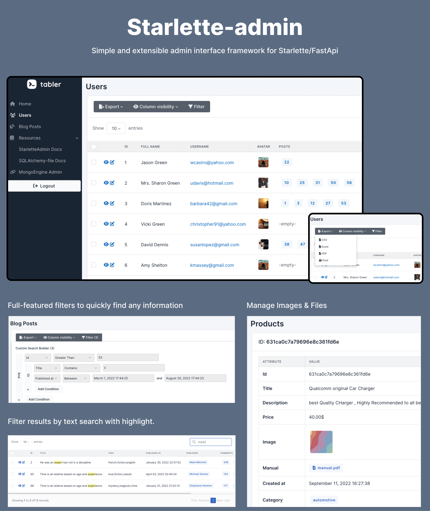

# starlette-admin

*Starlette-Admin* is a simple and extensible admin interface framework for Starlette/FastApi.

<p align="center">
<a href="https://github.com/jowilf/starlette-admin/actions/workflows/test.yml">
    
</a>
<a href="https://github.com/jowilf/starlette-admin/actions">
    
</a>
<a href="https://codecov.io/gh/jowilf/starlette-admin">
    
</a>
<a href="https://pypi.org/project/starlette-admin/">
    
</a>
<a href="https://pypi.org/project/starlette-admin/">
    
</a>
</p>



The key features are:

* **Flexibility :** The biggest feature of *Starlette-Admin* is flexibility. Start with autogenerated CRUD-views of your
  model and customize those views & forms as the need arises.
* **Datatables :** *Starlette-Admin* use [Datatables](https://datatables.net/) to render list. Main Features included
  are:
    * **Multi-column ordering:** Sort data by multiple columns at once.
    * **Full-text search:** Filter results by text search with highlight.
    * **Search Builder:** Filter results by complex query including `AND` and `OR` conditions.
    * **Many Export options:** Export your data to CSV, PDF, Excel and Browser Print.
    * You can easily include any other features you need from datatables.
      Read [Datatables documentation](https://datatables.net/) for more information.
* **Files Handling :** Easily attach files to your model. Thanks
  to [SQLAlchemy-file](https://github.com/jowilf/sqlalchemy-file) for SQLAlchemy integration
* **Multiple admin :** Expose multiple admin interfaces.
* **Modern UI** using [Tabler](https://tabler.io/)

This project is inspired by *Flask-Admin* and the main goal is to provide similar tool for Starlette/FastApi.

*Starlette-Admin* is designed to work with any ORM but have currently built-in support for:

* [SQLAlchemy](https://www.sqlalchemy.org/)
* [SQLModel](https://sqlmodel.tiangolo.com/)
* [MongoEngine](http://mongoengine.org/)

---


**Documentation**: [https://jowilf.github.io/starlette-admin](https://jowilf.github.io/starlette-admin/)

**Source Code**: [https://github.com/jowilf/starlette-admin](https://github.com/jowilf/starlette-admin)

---

Demo Application
----------------

[starlette-admin-demo](https://github.com/jowilf/starlette-admin-demo) is a complete
Starlette application that showcases Starlette-Admin features.

click [here](https://starlette-admin-demo.jowilf.com/) to check the online version


## Installation

### PIP

```shell
$ pip install starlette-admin
```

### Poetry

```shell
$ poetry add starlette-admin
```

## Example

SQLAlchemy integration
```Python
from sqlalchemy import Column, Integer, String, create_engine
from sqlalchemy.ext.declarative import declarative_base
from starlette.applications import Starlette

from starlette_admin.contrib.sqla import Admin, ModelView

Base = declarative_base()
engine = create_engine("sqlite:///test.db", connect_args={"check_same_thread": False})


class Post(Base):
    __tablename__ = "posts"

    id = Column(Integer, primary_key=True)
    title = Column(String)


class PostView(ModelView, model=Post):
    pass


Base.metadata.create_all(engine)
app = Starlette()

admin = Admin(engine)
admin.add_view(PostView)
admin.mount_to(app)
```

MongoEngine integration
```Python
import mongoengine
from mongoengine import connect
from starlette.applications import Starlette
from starlette_admin.contrib.mongoengine import Admin, ModelView

connect("example")


class Post(mongoengine.Document):
    title = mongoengine.StringField(min_length=3, required=True)


class PostView(ModelView, document=Post):
    pass


app = Starlette()

admin = Admin()
admin.add_view(PostView)
admin.mount_to(app)
```
Access your admin interface in your browser at http://localhost:8000/admin

## Related projects and inspirations

* [Flask-Admin:](https://github.com/flask-admin/flask-admin) Simple and extensible administrative interface framework for Flask
* [FastApi-Admin:](https://github.com/fastapi-admin/fastapi-admin) A fast admin dashboard based on FastAPI and TortoiseORM.
* [sqladmin:](https://github.com/aminalaee/sqladmin) SQLAlchemy Admin for FastAPI and Starlette