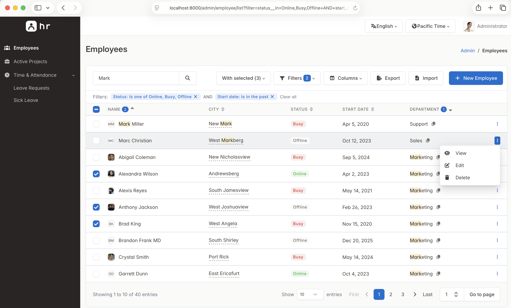

<div class="home-hero">
  <a class="home-badge" href="changelog/">
    <span class="home-badge-dot"></span>
    New documentation &nbsp;·&nbsp; See what changed
  </a>
  <h1 class="home-title">Extensible <span class="home-gradient">admin interfaces</span><br>for FastAPI &amp; Starlette</h1>
  <p class="home-sub">Instantly generate a comprehensive administrative UI from your SQLAlchemy, SQLModel, Beanie, MongoEngine, or Tortoise ORM models. Built on the modern <a href="https://tabler.io">Tabler UI kit</a>, starlette-admin delivers robust list views, auto-generated forms, data exports, and secure authentication. Configure your entire interface in Python without writing any frontend code.</p>
  <div class="home-actions">
    <a class="md-button md-button--primary home-btn" href="getting-started/quickstart/">Get started</a>
    <a class="md-button home-btn" href="https://starlette-admin-demo.jowilf.com/">Live demo</a>
    <a class="md-button home-btn home-btn--github" href="https://github.com/jowilf/starlette-admin">
      <svg viewBox="0 0 16 16" width="16" height="16" fill="currentColor" aria-hidden="true"><path d="M8 0C3.58 0 0 3.58 0 8c0 3.54 2.29 6.53 5.47 7.59.4.07.55-.17.55-.38 0-.19-.01-.82-.01-1.49-2.01.37-2.53-.49-2.69-.94-.09-.23-.48-.94-.82-1.13-.28-.15-.68-.52-.01-.53.63-.01 1.08.58 1.23.82.72 1.21 1.87.87 2.33.66.07-.52.28-.87.51-1.07-1.78-.2-3.64-.89-3.64-3.95 0-.87.31-1.59.82-2.15-.08-.2-.36-1.02.08-2.12 0 0 .67-.21 2.2.82.64-.18 1.32-.27 2-.27.68 0 1.36.09 2 .27 1.53-1.04 2.2-.82 2.2-.82.44 1.1.16 1.92.08 2.12.51.56.82 1.27.82 2.15 0 3.07-1.87 3.75-3.65 3.95.29.25.54.73.54 1.48 0 1.07-.01 1.93-.01 2.2 0 .21.15.46.55.38A8.013 8.013 0 0 0 16 8c0-4.42-3.58-8-8-8z"/></svg>
      Star on GitHub
    </a>
  </div>
  <div class="home-pip"><code>pip install starlette-admin</code></div>
  <div class="home-shot">
    
  </div>
</div>

<h2 class="home-section-title">Built-in features</h2>
<p class="home-lede">Get everything you need right out of the box. Every core feature includes well-documented extension points to support your specific requirements.</p>

<div class="home-cards">
  <a class="home-card" href="user-guide/views/">
    <span class="home-card-icon hc-sky"><svg viewBox="0 0 24 24" fill="none" stroke="currentColor" stroke-width="2" stroke-linecap="round" stroke-linejoin="round"><path d="M3 5a2 2 0 0 1 2-2h14a2 2 0 0 1 2 2v14a2 2 0 0 1-2 2H5a2 2 0 0 1-2-2z"/><path d="M3 10h18"/><path d="M10 3v18"/></svg></span>
    <h3>Tables</h3>
    <p>Browse, search, and sort data using pagination, multi-column ordering, and state-preserving URLs. Edit fields inline directly from the list view.</p>
  </a>
  <a class="home-card" href="user-guide/filters/">
    <span class="home-card-icon hc-violet"><svg viewBox="0 0 24 24" fill="none" stroke="currentColor" stroke-width="2" stroke-linecap="round" stroke-linejoin="round"><path d="M4 4h16v2.172a2 2 0 0 1-.586 1.414L15 12v7l-6 2v-8.5L4.52 7.572A2 2 0 0 1 4 6.227z"/></svg></span>
    <h3>Filters</h3>
    <p>Build complex nested AND/OR queries directly within the UI. Take advantage of type-aware operators for text, numbers, dates, and booleans.</p>
  </a>
  <a class="home-card" href="user-guide/fields/">
    <span class="home-card-icon hc-amber"><svg viewBox="0 0 24 24" fill="none" stroke="currentColor" stroke-width="2" stroke-linecap="round" stroke-linejoin="round"><path d="M7 7H6a2 2 0 0 0-2 2v9a2 2 0 0 0 2 2h9a2 2 0 0 0 2-2v-1"/><path d="M20.385 6.585a2.1 2.1 0 0 0-2.97-2.97L9 12v3h3z"/><path d="M16 5l3 3"/></svg></span>
    <h3>Forms &amp; uploads</h3>
    <p>Auto-generate forms that support over 25 field types and complex relational data. Handle file uploads seamlessly to local or S3 storage.</p>
  </a>
  <a class="home-card" href="user-guide/actions/">
    <span class="home-card-icon hc-rose"><svg viewBox="0 0 24 24" fill="none" stroke="currentColor" stroke-width="2" stroke-linecap="round" stroke-linejoin="round"><path d="M13 3v7h6l-8 11v-7H5z"/></svg></span>
    <h3>Actions</h3>
    <p>Create custom bulk and row-level operations using standard Python decorators. Intercept execution using confirmation modals and custom payload forms.</p>
  </a>
  <a class="home-card" href="user-guide/export-import/">
    <span class="home-card-icon hc-emerald"><svg viewBox="0 0 24 24" fill="none" stroke="currentColor" stroke-width="2" stroke-linecap="round" stroke-linejoin="round"><path d="M4 17v2a2 2 0 0 0 2 2h12a2 2 0 0 0 2-2v-2"/><path d="M7 11l5 5 5-5"/><path d="M12 4v12"/></svg></span>
    <h3>Export &amp; import</h3>
    <p>Export records instantly to CSV, Excel, JSON, PDF, or any tablib-supported format. Safely import bulk data using a preview-first wizard that enforces strict row-level validation before executing database writes.</p>
  </a>
  <a class="home-card" href="user-guide/auth/">
    <span class="home-card-icon hc-indigo"><svg viewBox="0 0 24 24" fill="none" stroke="currentColor" stroke-width="2" stroke-linecap="round" stroke-linejoin="round"><path d="M12 3a12 12 0 0 0 8.5 3A12 12 0 0 1 12 21 12 12 0 0 1 3.5 6 12 12 0 0 0 12 3"/><circle cx="12" cy="11" r="1"/><path d="M12 12v2.5"/></svg></span>
    <h3>Auth &amp; security</h3>
    <p>Integrate your preferred authentication provider. Deploy with production-ready defaults like CSRF protection and built-in limits for exports and imports.</p>
  </a>
  <a class="home-card" href="user-guide/inline-forms/">
    <span class="home-card-icon hc-cyan"><svg viewBox="0 0 24 24" fill="none" stroke="currentColor" stroke-width="2" stroke-linecap="round" stroke-linejoin="round"><path d="M13 5h8"/><path d="M13 9h5"/><path d="M13 15h8"/><path d="M13 19h5"/><rect x="3" y="4" width="6" height="6" rx="1"/><rect x="3" y="14" width="6" height="6" rx="1"/></svg></span>
    <h3>Inline forms</h3>
    <p>Manage relational data dynamically. Edit child records directly inside the parent model form without disrupting your workflow.</p>
  </a>
  <a class="home-card" href="user-guide/custom-views/">
    <span class="home-card-icon hc-orange"><svg viewBox="0 0 24 24" fill="none" stroke="currentColor" stroke-width="2" stroke-linecap="round" stroke-linejoin="round"><rect x="3" y="12" width="6" height="8" rx="1"/><rect x="9" y="8" width="6" height="12" rx="1"/><rect x="15" y="4" width="6" height="16" rx="1"/></svg></span>
    <h3>Dashboards</h3>
    <p>Design tailored home pages using built-in statistics, charts, and table widgets. You can also integrate a fully custom view.</p>
  </a>
  <a class="home-card" href="user-guide/i18n/">
    <span class="home-card-icon hc-teal"><svg viewBox="0 0 24 24" fill="none" stroke="currentColor" stroke-width="2" stroke-linecap="round" stroke-linejoin="round"><path d="M4 5h7"/><path d="M9 3v2c0 4.418-2.239 8-5 8"/><path d="M5 9c0 2.144 2.952 3.908 6.7 4"/><path d="M12 20l4-9 4 9"/><path d="M19.1 18h-6.2"/></svg></span>
    <h3>i18n &amp; timezones</h3>
    <p>Benefit from out-of-the-box multilingual support and automatic locale-aware formatting with precise timezone handling.</p>
  </a>
</div>

<div class="home-code-head">
  <svg class="home-code-mark" viewBox="0 0 24 24" fill="none" stroke="currentColor" stroke-width="2" stroke-linecap="round" stroke-linejoin="round" aria-hidden="true"><path d="M7 8l-4 4 4 4"/><path d="M17 8l4 4-4 4"/><path d="M14 4l-4 16"/></svg>
  <h2 class="home-section-title">Everything is Python</h2>
  <p class="home-lede">Build complete administrative interfaces using a pure Python API designed for <strong>rapid development</strong>, <strong>intuitive syntax</strong>, and <strong>long-term maintainability</strong>.</p>
</div>

=== "Mount the admin"

    <span class="home-tour-title" role="heading" aria-level="3">Mount the admin panel</span>

    Register a model and mount the admin panel on any FastAPI or Starlette application, then run it using `fastapi dev` and open `/admin`.

    <a class="home-tour-btn" href="getting-started/quickstart/">View the documentation</a>

    ```python title="main.py"
    from fastapi import FastAPI
    from sqlalchemy import create_engine
    from starlette_admin.contrib.sqla import Admin, ModelView

    from models import Base, Post

    engine = create_engine("sqlite:///blog.db")
    Base.metadata.create_all(engine)

    app = FastAPI()

    admin = Admin(engine, title="Blog Admin", secret_key="change-me")
    admin.add_view(ModelView(Post, icon="fa fa-newspaper"))
    admin.mount_to(app)
    ```

=== "Views"

    <span class="home-tour-title" role="heading" aria-level="3">Views</span>

    Tune search, sorting, default ordering, and export formats using plain class attributes. Arrange your create and edit forms using `form_layout`.

    <a class="home-tour-btn" href="user-guide/views/">View the documentation</a>

    ```python title="views.py"
    from starlette_admin.contrib.sqla import ModelView


    class PostView(ModelView):
        fields = ["id", "title", "author", "content", "published", "created_at"]
        searchable_fields = ["title", "content"]
        fields_default_sort = [("created_at", True)]
        exporters = ["csv", "xlsx", "json"]
        form_layout = [
            ("title", "author"),
            "content",
            ("published", "created_at"),
        ]


    admin.add_view(PostView(Post, icon="fa fa-newspaper"))
    ```

=== "Fields"

    <span class="home-tour-title" role="heading" aria-level="3">Fields</span>

    Override any auto-detected field to control validation, per-page visibility, and how the system reads and displays values.

    <a class="home-tour-btn" href="user-guide/fields/">View the documentation</a>

    ```python title="views.py"
    from starlette_admin import DateTimeField, RequestAction, StringField, TextAreaField
    from starlette_admin.contrib.sqla import ModelView


    class PostView(ModelView):
        fields = [
            "id",
            StringField("title", required=True, help_text="Shown on the blog"),
            TextAreaField("content", exclude_from_list=True),
            StringField(
                "author_email",
                getter=lambda request, obj: obj.author.email,
                formatter={RequestAction.LIST: lambda request, value: value or "unset"},
            ),
            DateTimeField("created_at", read_only=True, exclude_from_create=True),
        ]
    ```

=== "Filters"

    <span class="home-tour-title" role="heading" aria-level="3">Filters</span>

    Extend the built-in query builder with custom filters to support specific business requirements. You can apply complex operations directly to the underlying database model.

    <a class="home-tour-btn" href="user-guide/filters/">View the documentation</a>

    ```python title="filters.py"
    from datetime import datetime
    from typing import Any

    from starlette_admin.contrib.sqla import ModelView
    from starlette_admin.filters.base import BaseFilter, FilterApplyContext, FilterDataType


    class ActiveThisMonthFilter(BaseFilter):
        name = "this_month"
        label = "Created this month"
        data_type = FilterDataType.NONE  # no value input: the range is derived from now()

        def apply(self, ctx: FilterApplyContext) -> Any:
            now = datetime.utcnow()
            start = now.replace(day=1, hour=0, minute=0, second=0, microsecond=0)
            col = getattr(ctx.view.model, ctx.field_name)
            return col.between(start, now)

    class ProductView(ModelView):
        fields = [
            DateTimeField(
                "created_at",
                filters=[ActiveThisMonthFilter, ...],
            ),
        ]
    ```

=== "Actions"

    <span class="home-tour-title" role="heading" aria-level="3">Actions</span>

    Attach business operations using a simple decorator. Confirmation modals, custom forms, and flash messages are built directly into the framework.

    <a class="home-tour-btn" href="user-guide/actions/">View the documentation</a>

    ```python title="views.py"
    from starlette.requests import Request
    from starlette_admin import ActionSelection, action, flash
    from starlette_admin.contrib.sqla import ModelView


    class ArticleView(ModelView):
        actions = ["publish", "delete"]

        @action(
            name="publish",
            text="Mark as published",
            confirmation="Publish the selected articles?",
            submit_btn_text="Yes, publish",
        )
        async def publish(self, request: Request, selection: ActionSelection) -> None:
            articles = await selection.rows()
            for article in articles:
                article.published = True
            flash(request, f"{len(articles)} articles published.", "success")
    ```

=== "Authentication"

    <span class="home-tour-title" role="heading" aria-level="3">Authentication</span>

    Implement three standard methods around your own credential check. The system handles the login page, sessions, and redirects for you.

    <a class="home-tour-btn" href="user-guide/auth/">View the documentation</a>

    ```python title="auth.py"
    from starlette.requests import Request
    from starlette_admin.auth import AdminUser, AuthProvider, LoginFailed


    class MyAuthProvider(AuthProvider):
        async def login(self, username, password, remember_me, request: Request) -> None:
            if not await check_credentials(username, password):
                raise LoginFailed("Invalid username or password")
            request.session["username"] = username

        async def authenticate(self, request: Request) -> AdminUser | None:
            if username := request.session.get("username"):
                return AdminUser(username=username)
            return None

        async def logout(self, request: Request) -> None:
            request.session.clear()


    admin = Admin(engine, auth_provider=MyAuthProvider(), secret_key=SECRET)
    ```

=== "Dashboard"

    <span class="home-tour-title" role="heading" aria-level="3">Dashboard</span>

    Compose the admin home page using statistic, chart, and table widgets that query live data on every request.

    <a class="home-tour-btn" href="user-guide/custom-views/">View the documentation</a>

    ```python title="dashboard.py"
    from starlette_admin import CardRowWidget, ChartWidget, CustomView, StatWidget

    dashboard = CardRowWidget(
        children=[
            StatWidget(title="Orders", value_callback=count_orders, countup=True),
            StatWidget(title="Revenue", value_callback=sum_revenue, color="success"),
            ChartWidget(title="Sales", chart_type="area", series_callback=sales_series),
        ]
    )

    admin = Admin(
        engine,
        title="Shop Admin",
        secret_key="change-me",
        index_view=CustomView(menu_label="Dashboard", icon="fa fa-home", widget=dashboard),
    )
    ```

<h2 class="home-section-title">Plugins &amp; extensions</h2>
<p class="home-lede">Every layer is replaceable. Ship features as self-contained plugins or hook into any of the dedicated extension points to tailor the framework to your domain.</p>

<div class="home-plugins">
  <div class="home-plugin-panel">
    <span class="home-eyebrow hc-violet">Drop-in plugins</span>
    <h3>Zero-boilerplate plugins</h3>
<p>Install a plugin package and pass it directly to your <code>Admin</code> instance. Fields, converters, templates, and assets wire themselves together automatically, delivering complex features instantly.</p>
    <div class="home-snippet">

    ```python
    from starlette_admin_geospatial import GeospatialPlugin
    from starlette_admin.contrib.sqla import Admin

    admin = Admin(
        engine,
        plugins=[GeospatialPlugin(default_zoom=13)],
    )
    ```

    </div>
    <a class="home-more" href="advanced/plugins/">Read the plugins guide</a>
  </div>
  <div class="home-plugin-panel">
    <span class="home-eyebrow hc-emerald">Extension points</span>
    <h3>Hook into any component</h3>
    <p>Predefined interfaces allow you to swap or augment each concern independently. Subclass the base you need and register it. You can customize everything from the authentication flow to the export formats.</p>
    <ul class="home-hooks">
      <li><a href="advanced/custom-fields/"><span>Custom fields</span><code>BaseField</code></a></li>
      <li><a href="advanced/custom-filters/"><span>Custom filters</span><code>BaseFilter</code></a></li>
      <li><a href="user-guide/export-import/"><span>Exporters</span><code>BaseExporter</code></a></li>
      <li><a href="user-guide/export-import/"><span>Importers</span><code>BaseImporter</code></a></li>
      <li><a href="advanced/custom-themes/"><span>Themes</span><code>BaseTheme</code></a></li>
      <li><a href="user-guide/auth/"><span>Auth providers</span><code>BaseAuthProvider</code></a></li>
      <li><a href="user-guide/file-storage/"><span>Storage backends</span><code>BaseStorage</code></a></li>
      <li><a href="user-guide/custom-views/"><span>Dashboard widgets</span><code>BaseWidget</code></a></li>
      <li><a href="advanced/templates/"><span>Templates</span><code>templates_dir</code></a></li>
    </ul>
    <a class="home-more" href="advanced/extension-points/">Explore all extension points</a>
  </div>
</div>
