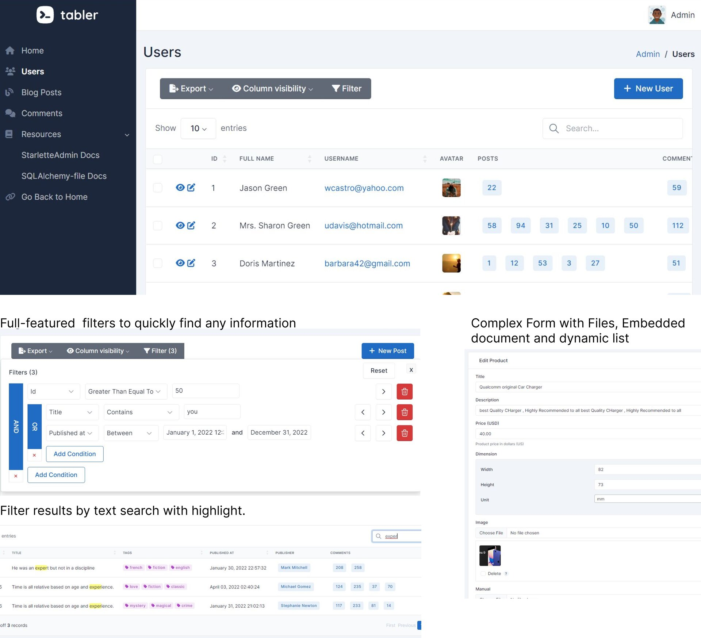

# Genel Bakış

*Starlette-Admin*, Starlette/FastAPI uygulamaları için hızlı, zarif ve genişletilebilir bir yönetici arayüzü framework'üdür.

<p align="center">
<a href="https://github.com/jowilf/starlette-admin/actions/workflows/test.yml">
    
</a>
<a href="https://github.com/jowilf/starlette-admin/actions">
    
</a>
<a href="https://codecov.io/gh/jowilf/starlette-admin">
    
</a>
<a href="https://pypi.org/project/starlette-admin/">
    
</a>
<a href="https://pypi.org/project/starlette-admin/">
    
</a>
</p>



## Başlarken

* [Dokümantasyonu](https://jowilf.github.io/starlette-admin) inceleyin.
* [Canlı demoyu](https://starlette-admin-demo.jowilf.com/) deneyin. ([Kaynak Kod](https://github.com/jowilf/starlette-admin-demo))
* [/examples](https://github.com/jowilf/starlette-admin/tree/main/examples) klasöründe bulunan kullanım örneklerini deneyin.
* Projeyi yararlı veya ilginç bulursanız, lütfen bir yıldız ⭐️ vermekten çekinmeyin.

## Özellikler

- Herhangi bir veri üzerinde kolayca <abbr title="CRUD: Create (Oluşturma), Read (Görüntüleme), Update (Güncelleme), Delete (Silme)">CRUD</abbr> işlemleri yapın.
- Otomatik form doğrulama.
- [Datatables](https://datatables.net/) ile gelişmiş tablo widget'ı.
- Arama ve filtreleme
- Arama sonucu vurgulama
- Çok sütunlu sıralama
- CSV/EXCEL/PDF ve Tarayıcı Yazdırma ile veriyi dışa aktarın
- <abbr title="Authentication">Kimlik Doğrulama</abbr>
- <abbr title="Authorization">Yetkilendirme</abbr>
- Dosya yönetimi
- Özelleştirilmiş görünümler
- Özelleştirilmiş toplu işlemler
- Desteklenen ORM'ler
    * [SQLAlchemy](https://www.sqlalchemy.org/)
    * [SQLModel](https://sqlmodel.tiangolo.com/)
    * [MongoEngine](http://mongoengine.org/)
    * [ODMantic](https://github.com/art049/odmantic/)
    * Özelleştirilmiş arayüz ([doküman](https://jowilf.github.io/starlette-admin/advanced/base-model-view/), [örnek](https://github.com/jowilf/starlette-admin/tree/main/examples/custom-backend))
- Çoklu dil desteği

## Kurulum

### PIP

```shell
$ pip install starlette-admin
```

### Poetry

```shell
$ poetry add starlette-admin
```

## Örnek

SQLAlchemy model ile basit bir örnek:

```python
from sqlalchemy import Column, Integer, String, create_engine
from sqlalchemy.ext.declarative import declarative_base
from starlette.applications import Starlette
from starlette_admin.contrib.sqla import Admin, ModelView

Base = declarative_base()
engine = create_engine("sqlite:///test.db", connect_args={"check_same_thread": False})


# Modeli tanımlayın
class Post(Base):
    __tablename__ = "posts"

    id = Column(Integer, primary_key=True)
    title = Column(String)


Base.metadata.create_all(engine)

app = Starlette()  # FastAPI()

# Admin oluşturun
admin = Admin(engine, title="Example: SQLAlchemy")

# Görünüm ekle
admin.add_view(ModelView(Post))

# Admin'i uygulamanıza bağlayın
admin.mount_to(app)
```

Yönetici arayüzüne tarayıcınız üzerinden [http://localhost:8000/admin](http://localhost:8000/admin) adresine giderek erişebilirsiniz.

## Üçüncü Taraf

*starlette-admin* diğer açık kaynaklı projelerle birlikte geliştirilmiştir:

- [Tabler](https://tabler.io/)
- [Datatables](https://datatables.net/)
- [jquery](https://jquery.com/)
- [Select2](https://select2.org/)
- [flatpickr](https://flatpickr.js.org/)
- [moment](http://momentjs.com/)
- [jsoneditor](https://github.com/josdejong/jsoneditor)
- [fontawesome](https://fontawesome.com/)
- [TinyMCE](https://www.tiny.cloud/)

## Katkıda Bulunma

Katkılarınızı bekliyoruz! Başlamadan önce lütfen [katkıda bulunma rehberimizi](https://github.com/jowilf/starlette-admin/blob/main/CONTRIBUTING.md) okuyun.
