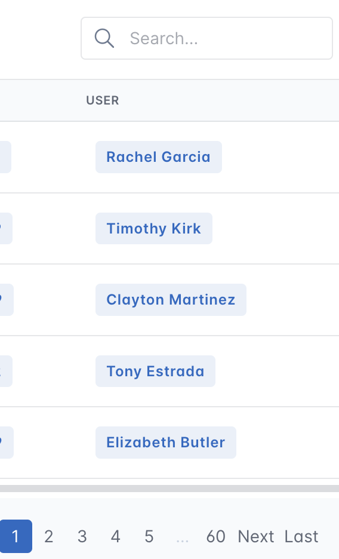
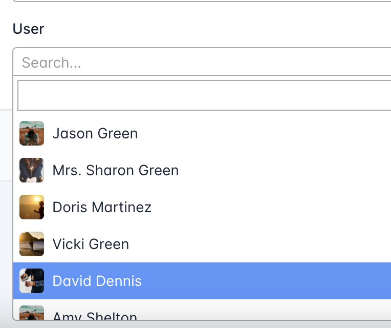

# ModelView Konfigürasyonu

ModelView'lerinizi özelleştirmek için birçok seçenek mevcuttur. Tam listeyi görmek için lütfen API dokümantasyonuna bakın: [BaseModelView()][starlette_admin.views.BaseModelView].

En sık kullanılan seçenekler şunlardır:

## Fields - Alanlar

Yönetici görünümünde hangi alanların dahil edileceğini belirlemek için ModelView sınıfının `fields` özelliğini kullanabilirsiniz.

```Python hl_lines="21"
from sqlalchemy import JSON, Column, Integer, String, Text, create_engine
from sqlalchemy.ext.declarative import declarative_base
from starlette.applications import Starlette
from starlette_admin import TagsField
from starlette_admin.contrib.sqla import Admin, ModelView

Base = declarative_base()
engine = create_engine("sqlite:///test.db", connect_args={"check_same_thread": False})


class Post(Base):
    __tablename__ = "posts"

    id = Column(Integer, primary_key=True)
    title = Column(String)
    tags = Column(JSON)
    content = Column(Text)


class PostView(ModelView):
    fields = ["id", "title", Post.content, TagsField("tags", label="Tags")]


app = Starlette()

admin = Admin(engine)
admin.add_view(PostView(Post, icon="fa fa-blog"))
admin.mount_to(app)
```

## Exclusions - Hariç Tutulanlar

Admin görünümünün farklı bölümlerinde hangi alanların görüntüleneceğini özelleştirmek için kullanabileceğiniz birkaç seçenek vardır. Bunlar:

* `exclude_fields_from_list`: Liste görünümünde hariç tutulacak alanların listesi.
* `exclude_fields_from_detail`: Detay görünümünde hariç tutulacak alanların listesi.
* `exclude_fields_from_create`: Oluşturma sayfasında hariç tutulacak alanların listesi.
* `exclude_fields_from_edit`: Düzenleme sayfasında hariç tutulacak alanların listesi.

```Python
class PostView(ModelView):
    exclude_fields_from_list = [Post.content, Post.tags]
```

!!! note "Not"
    Daha gelişmiş kullanımlarda [ModelView.get_fields_list()][starlette_admin.views.BaseModelView.get_fields_list] metodunu geçersiz kılabilirsiniz.

## Searching & Sorting - Arama ve Sıralama

Hangi alanların sıralanabilir veya aranabilir olduğunu belirlemek için kullanabileceğiniz birkaç seçenek vardır.

* `searchable_fields` aranabilir alanların listesi içindir.
* `sortable_fields` sıralanabilir alanların listesi içindir.
* `fields_default_sort` başlangıçta yapılacak varsayılan sıralama içindir.

!!! usage "Kullanım"

    ```Python
    class PostView(ModelView):
        sortable_fields = [Post.id, "title"]
        searchable_fields = [Post.id, Post.title, "tags"]
        fields_default_sort = ["title", ("price", True)]
    ```

## Exporting - Dışarı Aktarma

Starlette-admin'in en güçlü özelliklerinden biri, liste sayfasından verileri dışa aktarabilme özelliğidir.

Dışarı aktarma seçeneklerini her `ModelView` için aşağıdaki özellikleri kullanarak belirtebilirsiniz:

* `export_fields`: Dışa aktarmada dahil edilecek alanların listesi.
* `export_types`: Dışa aktarılabilir dosya türlerinin listesi. Kullanılabilir dışa aktarmalar `['csv', 'excel', 'pdf', 'print']` şeklindedir. Varsayılan olarak, yalnızca `pdf` devre dışı bırakılmıştır.

!!! example "Örnek"

    ```Python
    from starlette_admin import ExportType

    class PostView(ModelView):
        export_fields = [Post.id, Post.content, Post.tags]
        export_types = [ExportType.CSV, ExportType.EXCEL]
    ```

## Pagination - Sayfalandırma

Liste sayfasındaki sayfalandırma seçenekleri konfigüre edilebilir. Kullanılabilir seçenekler:

* `page_size`: List sayfasında gösterilecek varsayılan öğe sayısı. Varsayılan değer `10` olarak ayarlanmıştır.
* `page_size_options`: Liste sayfasında gösterilecek sayfalandırma seçenekleri. Varsayılan değer `[10, 25, 50, 100]` olarak ayarlanmıştır. Tüm kayıtları göstermek için `-1` kullanın.

!!! example "Örnek"

    ```Python
    class PostView(ModelView):
        page_size = 5
        page_size_options = [5, 10, 25, 50, -1]
    ```

## Templates - Şablonlar

Şablon dosyaları, `Jinja2` kullanılarak oluşturulmuştur ve konfigürasyonlarda tamamen değiştirilebilir. Kullanılabilir sayfalar:

* `list_template`: Liste görünümü şablonu. Varsayılan değer `list.html` olarak ayarlanmıştır.
* `detail_template`: Detay görünümü şablonu. Varsayılan değer `detail.html` olarak ayarlanmıştır.
* `create_template`: Oluşturma görünümü şablonu. Varsayılan değer `create.html` olarak ayarlanmıştır.
* `edit_template`: Düzenleme görünümü şablonu. Varsayılan değer `edit.html` olarak ayarlanmıştır.

!!! example "Örnek"

    ```Python
    class PostView(ModelView):
        detail_template = "post_detail.html"
    ```

## Datatables Extensions - Datatables Eklentileri

*starlette-admin* ile birlikte bazı datatable eklentileri varsayılan olarak gelir. Bu eklentilerden herhangi birini `ModelView`'inizde aşağıdaki seçenekleri geçersiz kılarak devre dışı bırakabilirsiniz:

* `column_visibility`: [column visibility](https://datatables.net/extensions/buttons/built-in#Column-visibility) eklentisini etkinleştir/devre dışı bırak
* `search_builder`: [search builder](https://datatables.net/extensions/searchbuilder/) eklenini etkinleştir/devre dışı bırak
* `responsive_table`: [responsive](https://datatables.net/extensions/responsive/) eklentisini etkinleştir/devre dışı bırak
* `save_state`: [state saving](https://datatables.net/examples/basic_init/state_save.html) eklentisini etkinleştir/devre dışı bırak

!!! example "Örnek"

    ```python
    class PostView(ModelView):
        column_visibility = False
        search_builder = False
        responsive_table = True
        save_state = True
    ```

## Object Representation - Nesne Temsili

*sarlette-admin* yönetici arayüzünde nesnelerin nasıl temsil edileceğini özelleştirmek için iki yöntem mevcuttur:

### `__admin_repr__`

Yönetici arayüzünde nesnelerin nasıl temsil edileceğini özelleştirmek için model sınıflarında kullanılabilen özel bir metoddur. Varsayılan olarak yalnızca nesnenin birincil anahtar özelliğinin değeri görüntülenir. Bununla birlikte, `__admin_repr__` metodunu kullanarak, nesneyi yönetici arayüzünde daha iyi temsil edebilecek bir `str` döndürebilirsiniz.

!!! example "Örnek"
    Aşağıdaki `User` modeli için örnek uygulama, yönetici arayüzünde kullanıcının birincil anahtar yerine tam adını gösterir:

    ```python
    class User:
        id: int
        first_name: str
        last_name: str

        async def __admin_repr__(self, request: Request):
            return f"{self.last_name} {self.first_name}"
    ```

    { width="200" }

### `__admin_select2_repr__`

`__admin_repr__` metoduna benzeyen bu metod, nesneyi `select2` bileşeninde görüntülemek için kullanılabilecek bir HTML döndürür. Varsaylına olarak nesnenin tüm özellikleri kullanılır, ancak ilişki ve dosya alanlarını içermez.

!!! note "Not"
    Döndürülen değer geçerli bir HTML olmalıdır.

!!! danger "Tehlike"
    <abbr title="Cross-Site Scripting">XSS</abbr> saldırılarını önlemek için veritabanı değerinizi atlayın.
    Jinja2 şablonlarını `autoescape=True` ile kullanabilirsiniz.
    Daha fazla bilgi için [OWASP websitesini](https://owasp.org/www-community/attacks/xss/) ziyaret edin.

    ```python
    from jinja2 import Template
    Template("Hello {{name}}", autoescape=True).render(name=name)
    ```

!!! example "Örnek"
    Kullanıcının adını ve fotoğrafını barındıran `User` modeli için örnek bir uygulama:

    ```python
    class User:
        id: int
        name: str
        photo_url: str

        async def __admin_select2_repr__(self, request: Request) -> str:
            return f'<div><span>{escape(self.name)}</span></div>'
    ```

    { width="300" }

## Hooks - Kancalar

Kancalar, varsayılan CRUD işlevlerini özelleştirmenin ve genişletmenin kolay bir yolunu sunan geri arama fonksiyonlarıdır. Öğe oluşturma, düzenleme veya silme gibi belirli işlemlerden önce veya sonra belirli işlemleri gerçekleştirmek için kancaları kullanabilirsiniz.

Mevcut kancalar şunlardır:

- [before_create(request, data, obj)][starlette_admin.views.BaseModelView.before_create]: Bir nesne oluşturulmadan önce çağrılır

- [after_create(request, obj)][starlette_admin.views.BaseModelView.after_create]: Bir nesne oluşturulduktan sonra çağrılır

- [before_edit(request, data, obj)][starlette_admin.views.BaseModelView.before_edit]: Varolan bir nesne güncellenmeden önce çağrılır

- [after_edit(request, obj)][starlette_admin.views.BaseModelView.after_edit]: Varolan bir nesne güncellendikten sonra çağrılır

- [before_delete(request, obj)][starlette_admin.views.BaseModelView.before_delete]:  Varolan bir nesne silinmeden önce çağrılır

- [after_delete(request, obj)][starlette_admin.views.BaseModelView.after_delete]: Varolan bir nesne silindikten sonra çağrılır

### Örnek

```python
class OrderView(ModelView):
    async def after_create(self, request: Request, order: Order):
        analytics.track_order_created(order)
```
