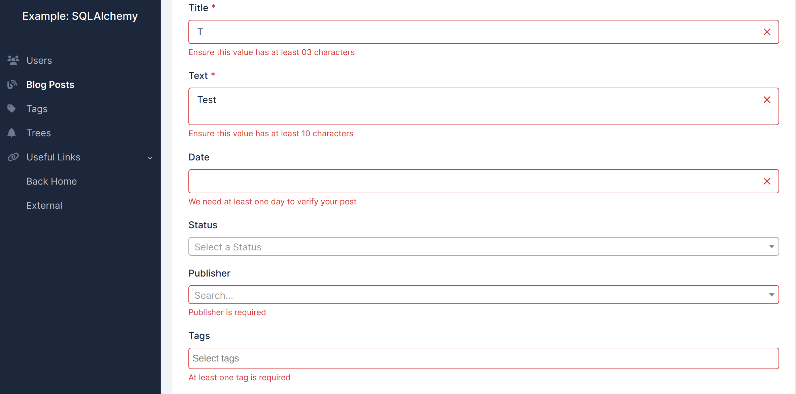
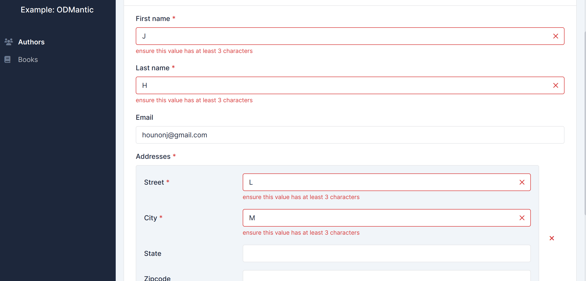

# Form Doğrulamaları

Starlette-admin, seçtiğiniz veritabanı arayüzüne bağlı olarak çalışmak üzere esnek ve bağımsız bir yapıda tasarlanmıştır.
Bu nedenle, dahili veri doğrulama özellikleri içermez. Bunun yerine, veri doğrulaması, seçtiğiniz veritabanı arayüzünün sağladığı doğrulama mekanizmalarına bağlı olacaktır.

## SQLAlchemy

Verinizi doğrulamak için kullanabileceğiniz birkaç seçenek vardır:

### Pydantic

[Pydantic](https://github.com/pydantic/pydantic) Python'ın <abbr title="type hint">tip belirteç</abbr>lerini kullanarak veri doğrulama özellikleri sağlayan yaygın olarak kullanılan bir Python kütüphanesidir.

Gönderilen verinin Pydantic ile otomatik olarak doğrulanması için, yalnızca bir Pydantic modeli tanımlamanız ve `starlette_admin.contrib.sqla.ext.pydantic.ModelView` kullanmanız yeterlidir.

!!! example "Örnek"

    ```python
    from starlette_admin.contrib.sqla.ext.pydantic import ModelView


    class Post(Base):
        __tablename__ = "posts"

        id = Column(Integer, primary_key=True)
        title = Column(String)
        content = Column(Text)
        views = Column(Integer)


    class PostIn(BaseModel):
        id: Optional[int] = Field(primary_key=True)
        title: str = Field(min_length=3)
        content: str = Field(min_length=10)
        views: int = Field(multiple_of=4)

        @validator("title")
        def title_must_contain_space(cls, v):
            if " " not in v.strip():
                raise ValueError("title must contain a space")
            return v.title()


    # Görünümü ekle
    admin.add_view(ModelView(Post, pydantic_model=PostIn))

    ```

### Özel Doğrulama

Ayrıca, belirli veri gereksinimlerini zorunda kılmak için kendi doğrulama fonksiyonlarınızı oluşturabilirsiniz.

!!! example "Örnek"

    ```python
    from starlette_admin.contrib.sqla import ModelView
    from starlette_admin.exceptions import FormValidationError


    class PostView(ModelView):

        async def validate(self, request: Request, data: Dict[str, Any]) -> None:
            """Form hatalarını göstermek için FormValidationError hatası oluşturun"""
            errors: Dict[str, str] = dict()
            _2day_from_today = date.today() + timedelta(days=2)
            if data["title"] is None or len(data["title"]) < 3:
                errors["title"] = "Ensure this value has at least 03 characters"
            if data["text"] is None or len(data["text"]) < 10:
                errors["text"] = "Ensure this value has at least 10 characters"
            if data["date"] is None or data["date"] < _2day_from_today:
                errors["date"] = "We need at least one day to verify your post"
            if data["publisher"] is None:
                errors["publisher"] = "Publisher is required"
            if data["tags"] is None or len(data["tags"]) < 1:
                errors["tags"] = "At least one tag is required"
            if len(errors) > 0:
                raise FormValidationError(errors)
            return await super().validate(request, data)
    ```

    

??? info "Bilgi"
    Örneğin tamamı [burada]((https://github.com/jowilf/starlette-admin/tree/main/examples/sqla)).

## SQLModel

SQLModel ile veri doğrulamak çok daha kolay bir hale geldi. Modelinizi tanımladıktan sonra, gönderilen herhangi bir veri otomatik olarak doğrulanır.

!!! example "Örnek"

    ```python
    from sqlmodel import SQLModel, Field
    from pydantic import validator


    class Post(SQLModel, table=True):
        id: Optional[int] = Field(primary_key=True)
        title: str = Field()
        content: str = Field(min_length=10)
        views: int = Field(multiple_of=4)

        @validator('title')
        def title_must_contain_space(cls, v):
            if ' ' not in v:
                raise ValueError('title must contain a space')
            return v.title()
    ```

    

??? info "Bilgi"
    Örneğin tamamı [burada]((htthttps://github.com/jowilf/starlette-admin/tree/main/examples/sqlmodel)).

## Odmantic

Veri doğrulaması, gönderilen verilerin tanımladığınız modele uygun olup olmadığı kontrol edilerek Odmantic tarafından otomatik bir şekilde gerçekleştirilir.

!!! example "Örnek"

    ```python
    from typing import List, Optional

    from odmantic import EmbeddedModel, Field, Model
    from pydantic import EmailStr


    class Address(EmbeddedModel):
        street: str = Field(min_length=3)
        city: str = Field(min_length=3)
        state: Optional[str]
        zipcode: Optional[str]


    class Author(Model):
        first_name: str = Field(min_length=3)
        last_name: str = Field(min_length=3)
        email: Optional[EmailStr]
        addresses: List[Address] = Field(default_factory=list)
    ```

    


??? info "Bilgi"
    Örneğin tamamına [buradan](https://github.com/jowilf/starlette-admin/tree/main/examples/odmantic) ulaşabilirsiniz.

## MongoEngine

Gönderilen veriler, model tanımınıza göre otomatik olarak doğrulanır.

!!! example "Örnek"

    ```python
    import mongoengine as db

    class Comment(db.EmbeddedDocument):
        name = db.StringField(min_length=3, max_length=20, required=True)
        value = db.StringField(max_length=20)


    class Post(db.Document):
        name = db.StringField(max_length=20, required=True)
        value = db.StringField(max_length=20)
        inner = db.ListField(db.EmbeddedDocumentField(Comment))
        lols = db.ListField(db.StringField(max_length=20))
    ```

    

??? info "Bilgi"
    Örneğin tamamına [buradan](https://github.com/jowilf/starlette-admin/tree/main/examples/mongoengine) ulaşabilirsiniz.
