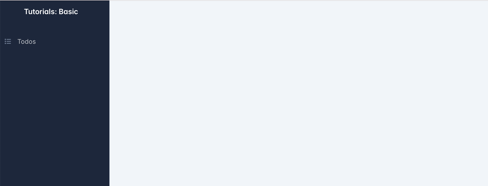
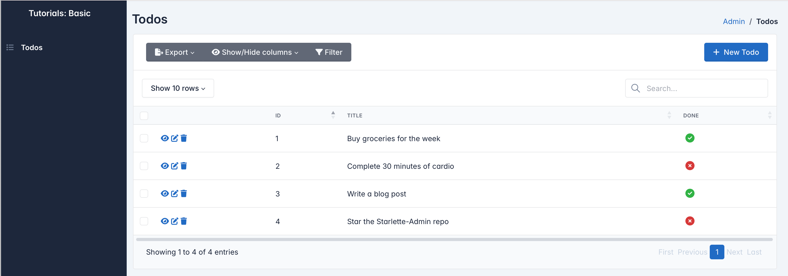
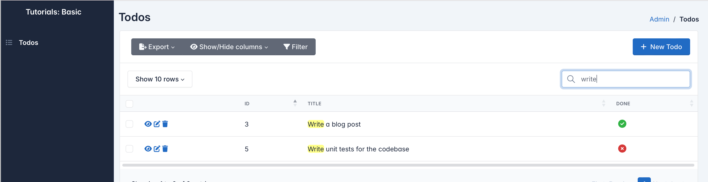
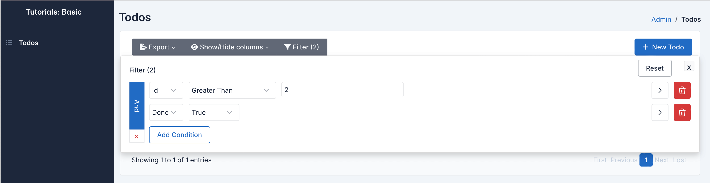
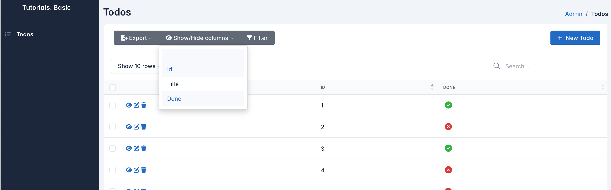
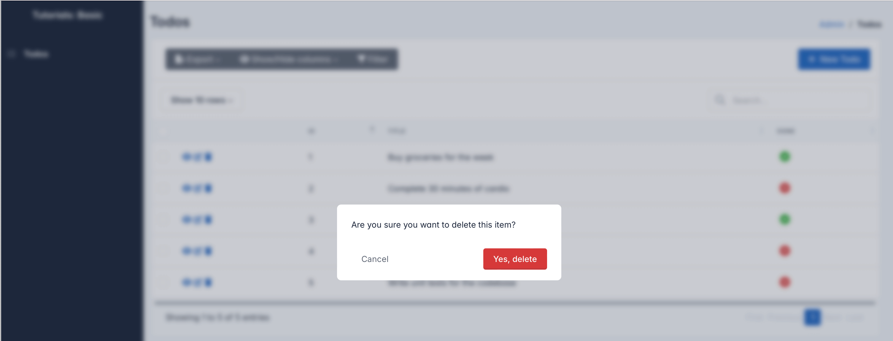
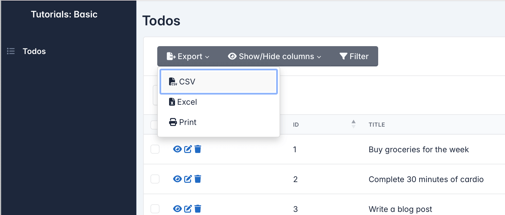
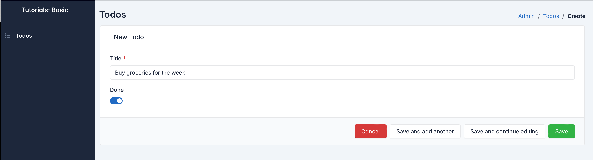
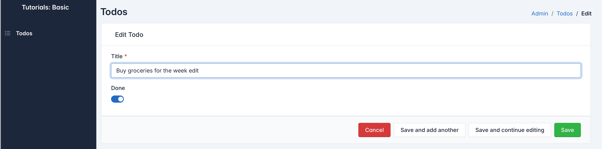

# Building your first admin panel

The goal of this tutorial is to guide you through the process of creating an admin panel to manage a simple Todo model
using Starlette-Admin.

By the end of this tutorial, you will have a user-friendly admin interface to perform CRUD (Create, Read, Update,
Delete) operations on Todo items without the need for writing any front-end code or complex database queries.

!!! quote "What you will learn"

    - How to generate a basic admin panel for your models
    - Familiarize yourself with the generated admin panel
    - Basic concepts of Starlette-Admin

## Project Setup

### Installation

* Create a virtual environment and activate it

=== "macOS/Linux"

    ```shell
    python -m venv env
    source env/bin/activate
    ```

=== "Windows"

    ```shell
    python -m venv env
    env\Scripts\activate
    ```

* Create a `requirements.txt` file with the following content

=== "SQLAlchemy"

    ```requirements
    starlette-admin
    sqlalchemy
    uvicorn
    ```

=== "SQLModel"

    ```requirements
    starlette-admin
    sqlmodel
    uvicorn
    ```

=== "MongoEngine"

    ```requirements
    starlette-admin
    mongoengine
    uvicorn
    ```

=== "ODMantic"

    ```requirements
    starlette-admin
    odmantic
    uvicorn
    ```

??? note

    If you prefer to setup a FastAPI project, add `fastapi` in your requirements file. For example,

    ```requirements
    fastapi
    starlette-admin
    sqlalchemy
    uvicorn
    ```

* Install the dependencies

```shell
pip install -r requirements.txt
```

### Project structure

    .
    │
    ├── env/                # Virtual environment directory
    ├── main.py             # Main tutorial file
    └── requirements.txt    # File specifying tutorial dependencies

In this tutorial, all code will be contained within the `main.py` file for simplicity. As you progress to real-world
applications, consider organizing your code into modular structures.

## Define the model

Now that our project is ready, let's write the Todo model, on which we will perform the CRUD Operations

=== "SQLAlchemy"

    ```python
    from sqlalchemy.orm import DeclarativeBase, Mapped, mapped_column


    class Base(DeclarativeBase):
        pass


    class Todo(Base):
        __tablename__ = "todo"

        id: Mapped[int] = mapped_column(primary_key=True)
        title: Mapped[str]
        done: Mapped[bool]
    ```

=== "SQLModel"

    ```python
    from typing import Optional

    from sqlmodel import Field, SQLModel


    class Todo(SQLModel, table=True):
        id: Optional[int] = Field(default=None, primary_key=True)
        title: str
        done: bool
    ```

=== "MongoEngine"

    ```python
    import mongoengine as db


    class Todo(db.Document):
        title = db.StringField()
        done = db.BooleanField()

    ```

=== "ODMantic"

    ```python
    from odmantic import Model


    class Todo(Model):
        title: str
        done: bool
    ```

Let's take a closer look at the attributes:

- `id (int)`: A unique identifier for each Todo item.
- `title (str)`: The title or description of the Todo item.
- `done (bool)`: A boolean value indicating whether the Todo item is marked as done.

??? note

    For **MongoEngine** and **ODMantic**, the `id` field is added automatically and serves as the unique identifier.
    You don't need to explicitly define it in the model.

## Configure the admin panel

### Initialization

To begin, we'll set up an empty admin interface:

=== "SQLAlchemy"

    ```python hl_lines="1 3 5 21"
    from sqlalchemy import create_engine
    from sqlalchemy.orm import DeclarativeBase, Mapped, mapped_column
    from starlette_admin.contrib.sqla import Admin

    engine = create_engine("sqlite:///basic.db", connect_args={"check_same_thread": False})


    class Base(DeclarativeBase):
        pass


    class Todo(Base):
        __tablename__ = "todo"

        id: Mapped[int] = mapped_column(primary_key=True)
        title: Mapped[str]
        done: Mapped[bool]


    # Create an empty admin interface
    admin = Admin(engine, title="Tutorials: Basic")
    ```

=== "SQLModel"

    ```python hl_lines="5 7 17"
    from typing import Optional

    from sqlalchemy import create_engine
    from sqlmodel import Field, SQLModel
    from starlette_admin.contrib.sqlmodel import Admin

    engine = create_engine("sqlite:///basic.db", connect_args={"check_same_thread": False})


    class Todo(SQLModel, table=True):
        id: Optional[int] = Field(default=None, primary_key=True)
        title: str
        done: bool


    # Create an empty admin interface
    admin = Admin(engine, title="Tutorials: Basic")
    ```

=== "MongoEngine"

    ```python hl_lines="2 11"
    import mongoengine as db
    from starlette_admin.contrib.mongoengine import Admin


    class Todo(db.Document):
        title = db.StringField()
        done = db.BooleanField()


    # Create an empty admin interface
    admin = Admin(title="Tutorials: Basic")
    ```

=== "ODMantic"

    ```python hl_lines="2 13"
    from odmantic import AIOEngine, Model
    from starlette_admin.contrib.odmantic import Admin

    engine = AIOEngine()


    class Todo(Model):
        title: str
        done: bool


    # Create an empty admin interface
    admin = Admin(engine, title="Tutorials: Basic")
    ```

### Adding a view for the Todo model

Now that the admin interface is initialized, the next step is to add a view for managing the `Todo` model.

```python
admin.add_view(ModelView(Todo))
```

In the code above, we use the function [add_view][starlette_admin.base.BaseAdmin.add_view] of
the [Admin][starlette_admin.base.BaseAdmin] class to include a view for
the `Todo` model within the admin interface.

The [ModelView][starlette_admin.base.BaseAdmin.add_view] class allow you to add a dedicated set of admin pages for
managing any model.

!!! important

    Ensure to import `ModelView` from the same package as the `Admin` class, which varies based on the ORM/ODM you are
    using. For instance, if you are using SQLAlchemy, the import statement is as follows:

    ```python
    from starlette_admin.contrib.sqla import Admin, ModelView
    ```

## Mount `admin` to your application

We can mount the `admin` on a Starlette or FastAPI application by using
the [mount_to][starlette_admin.base.BaseAdmin.mount_to] function and passing the app instance:

=== "Starlette"

    ```python
    from starlette.applications import Starlette

    app = Startette()

    # Mount admin to your app
    admin.mount_to(app)
    ```

=== "FastAPI"

    ```python
    from fastapi import FastAPI

    app = FastAPI()

    # Mount admin to your app
    admin.mount_to(app)
    ```

## Full Code

Below is the complete code for the tutorial:

=== "SQLAlchemy"

    ```python
    from sqlalchemy import create_engine
    from sqlalchemy.orm import DeclarativeBase, Mapped, mapped_column
    from starlette.applications import Starlette
    from starlette_admin.contrib.sqla import Admin, ModelView

    engine = create_engine("sqlite:///basic.db", connect_args={"check_same_thread": False})


    class Base(DeclarativeBase):
        pass


    class Todo(Base):
        __tablename__ = "todo"

        id: Mapped[int] = mapped_column(primary_key=True)
        title: Mapped[str]
        done: Mapped[bool]


    Base.metadata.create_all(engine)

    app = Starlette()  # or app = FastAPI()

    # Create an empty admin interface
    admin = Admin(engine, title="Tutorials: Basic")

    # Add view
    admin.add_view(ModelView(Todo, icon="fas fa-list"))

    # Mount admin to your app
    admin.mount_to(app)

    ```

=== "SQLModel"

    ```python
    from typing import Optional

    from sqlalchemy import create_engine
    from sqlmodel import Field, SQLModel
    from starlette.applications import Starlette
    from starlette_admin.contrib.sqlmodel import Admin, ModelView

    engine = create_engine("sqlite:///basic.db", connect_args={"check_same_thread": False})


    class Todo(SQLModel, table=True):
        id: Optional[int] = Field(default=None, primary_key=True)
        title: str
        done: bool


    SQLModel.metadata.create_all(engine)

    app = Starlette()  # or app = FastAPI()

    # Create an empty admin interface
    admin = Admin(engine, title="Tutorials: Basic")

    # Add view
    admin.add_view(ModelView(Todo, icon="fas fa-list"))

    # Mount admin to your app
    admin.mount_to(app)

    ```

=== "MongoEngine"

    ```python
    import mongoengine as db
    from mongoengine import connect, disconnect
    from starlette.applications import Starlette

    from starlette_admin.contrib.mongoengine import Admin, ModelView


    class Todo(db.Document):
        title = db.StringField()
        done = db.BooleanField()


    app = Starlette(
        on_startup=[lambda: connect("basic")],
        on_shutdown=[disconnect],
    )

    # Create an empty admin interface
    admin = Admin(title="Tutorials: Basic")

    # Add view
    admin.add_view(ModelView(Todo, icon="fas fa-list"))

    # Mount admin to your app
    admin.mount_to(app)

    ```

=== "ODMantic"

    ```python
    from odmantic import AIOEngine, Model
    from starlette.applications import Starlette
    from starlette_admin.contrib.odmantic import Admin, ModelView

    engine = AIOEngine()


    class Todo(Model):
        title: str
        done: bool


    app = Starlette()

    # Create an empty admin interface
    admin = Admin(engine, title="Tutorials: Basic")

    # Add views
    admin.add_view(ModelView(Todo, icon="fas fa-list"))

    # Mount app
    admin.mount_to(app)

    ```

## Run the server

We can now launch the server to make the admin interface available. This is done using the `uvicorn` command:

```shell
uvicorn main:app
```

The admin dashboard will be available at [http://127.0.0.1:8000/admin](http://127.0.0.1:8000/admin).

## Exploring the Admin interface

Let's take a tour of the admin interface autogenerated by Starlette-Admin and see it in action.

### Home Page

Navigate to the admin home page at [http://127.0.0.1:8000/admin](http://127.0.0.1:8000/admin). It should look something
like this:



The home page is empty right now except for the menu on the left. The menu has a single item called "Todos" that links
to the CRUD pages we generated for the Todo model.

!!! note

    We'll learn how to customize and add content to the home page later on.

### CRUD Pages

If you click on "Todos" in the menu, you'll be taken to the auto-generated CRUD pages for managing todo records.

#### Listing Page

This page lists the todo records



Let's go through some of the built-in functionality:

- **Search**

Type into the search box to filter records.



- **Filter**

Click the button to filter by column values.



!!! warning

    Make sure to reset the filters when you are done

- **Show/Hide Columns**

Customize visible columns



- **Delete**

Click the trash icon to delete a record.



- **Export**

Click Export and choose CSV or Excel.



#### Create a new todo item

From the listing page click on the button **New Todo** to navigate to the creation page

Fill the form and click **Save**. You'll be back on the list with the new Todo added.



#### Edit an item

From the listing page click on the **Edit (pencil) icon** on an existing Todo.
Change the title and save. You'll see the updated title in the list.



## Next Steps

You now have a basic admin interface for your Todo app.

Some next tutorials to continue learning:

- To be continued...

The final source code is available on GitHub at [...]()
